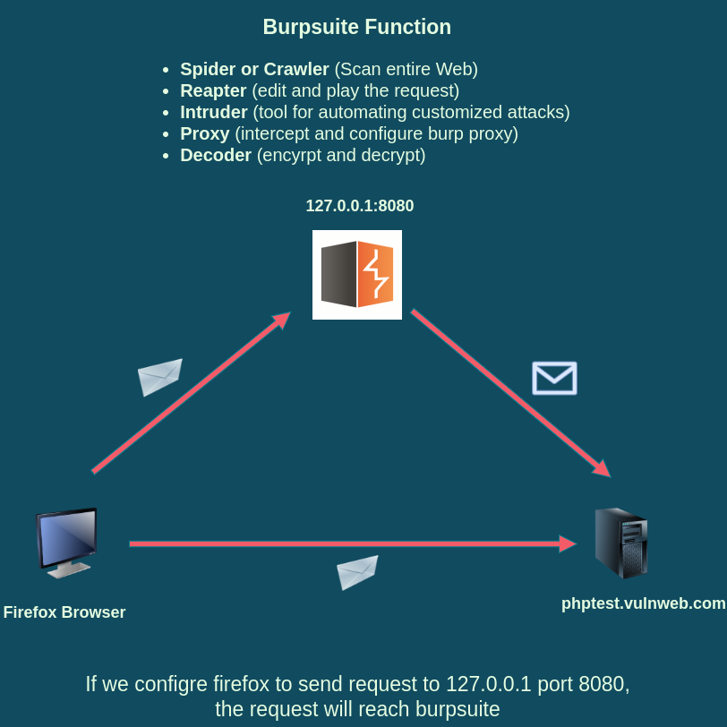

<h1 align="center"> Pentester Roadmap </h1>

## Contents

* [Hacking Methodology](#hacking-methodology )
* [Labs and Hand on](#labs-and-hand-on)
* [DVWA install](#how-to-insatll-dvwa-on-docker)
* [ZDResearch Lab Install](#zeresearch-installation)
* [Some Basic Attack](#some-basic-attack)
    * [Brute Force Attack](#bruteforce-attack)
    * [Zip Passwrod Cracking](#simple-brute-force-using-john-the-ripper)
    * [Command Injection](#command-injection)
    * [File Upload Vulnerability](#unrestricted-file-upload)

# Hacking Methodology

[Methodology_Mindmap](./ethical_hacking_mindmap.pdf)

# Detail Roadmap

https://github.com/pathakabhi24/Learn-Hacking-365-Days-

# Labs and Hand-on

  - Labs Websites

    - Tryhackme (https://tryhackme.com/)

    - Hackthebox Academy (https://academy.hackthebox.com/)

  - Virutal Mechine

    - Metasploitable

    - VulnHub (https://www.vulnhub.com/)

  - Docker Labs

    - ZDResearch 

    - DVWA (docker run --rm -it -p 80:80 vulnerables/web-dvwa)

# How to Install DVWA on Docker

## 1. Install `docker` on Linux

`sudo apt install docker.io`

## 2. Starting `docker` Engine

`sudo systemctl start docker`

## 3. 

## 4. Install DVWA on `docker`

`sudo docker run --rm -it -p 80:80 vulnerables/web-dvwa`

# ZDResearch Installation

## Interactive mode

`sudo docker run -p 8080:80 -it zdresearch/advanced-web-hacking http://localhost:8080`

## Demon Mode
`sudo docker run -p 8080:80 -td zdresearch/advanced-web-hacking http://localhost:8080`

# Some Basic Attack

## Burp Suite

## Bruteforce Attack

#### A brute force attack involves ‘guessing’ username and passwords to gain unauthorized access to a system

- Simple brute force attack
  - uses a systematic approach to ‘guess’ that doesn’t rely on outside logic.
- Dictionary attack
  - guesses usernames or passwords using a dictionary of possible strings or phrases (use wordlist)

## Simple brute-force using john-the-ripper

# Installation

- `snap install john-the-ripper`

- `git clone https://github.com/openwall/john.git`

## 1. Use `zip2john` tool to make hash

`zip2john test.zip > zip.hashes` 
or
`john-the-ripper.zip2john test.zip > zip.hashes`

## 2. Crack password with `john`

`john zip.hashes`

## Cracking with custom wordlist

`john --wordlist=wordlist.txt zip.hashes`

## Command Injection

- Command injection is an attack in which the goal is execution of arbitrary commands on the host operating system via a vulnerable application

## Unrestricted file upload

- Vulnerable upload functions allow attackers to bypass input controls, upload payloads and potentially perform command execution

- upload shell 